# UefiEraser —— 运行在 UEFI 环境下的磁盘数据粉碎工具

[English](#english)

> 在操作系统启动之前，用鼠标和键盘对**整块物理磁盘**、**单个分区**或**分区的空闲空间**
> 执行不可恢复的数据销毁。支持 13 种行业标准多遍覆写算法，以及 ATA Secure Erase /
> NVMe Format / NVMe Sanitize 设备级擦除。

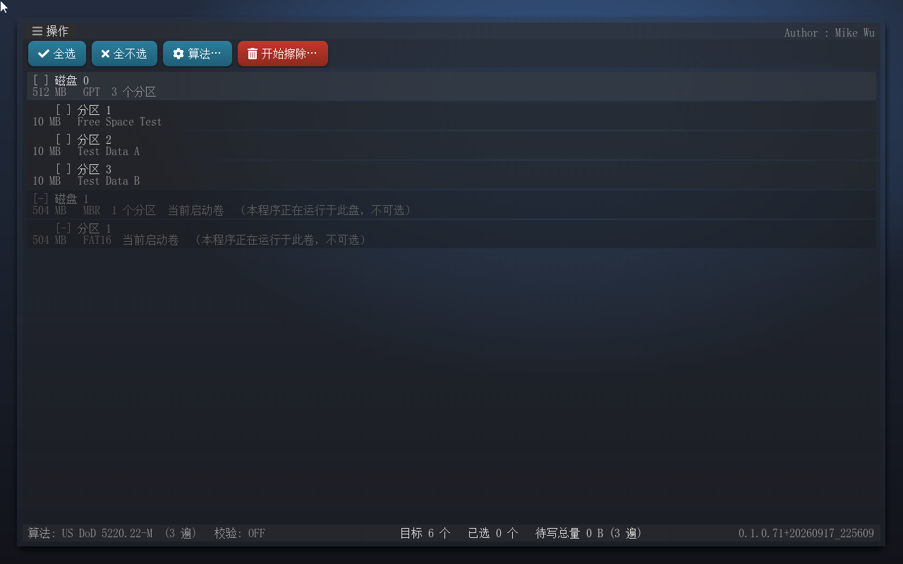

> ⚠️ **擦除不可恢复**。本工具用于销毁数据，操作前请确认目标与备份。

---

## 下载

| 文件 | 说明 |
|---|---|
| [UefiEraser-0.1.0.71-X64.efi](https://github.com/MikeWuPing/UefiEraser/releases/download/v0.1.0.71/UefiEraser-0.1.0.71-X64.efi) | 可直接运行的 UEFI 应用程序（X64，Debug 版，内置中文界面与字库） |
| [UefiEraser-产品手册-0.1.0.71.docx](https://github.com/MikeWuPing/UefiEraser/releases/download/v0.1.0.71/UefiEraser-Manual-zh-0.1.0.71.docx) | 产品说明书（Word，含全部界面截图与功能详解） |

最新版本见 [Releases](https://github.com/MikeWuPing/UefiEraser/releases)。把 `UefiEraser.efi`
拷到 FAT 格式的 U 盘，开机从 U 盘启动进入 UEFI Shell 即可运行（Secure Boot 需关闭）。

## 它解决什么问题

- **格式化不等于销毁。** 快速格式化只改元数据，数据还在盘上，一个恢复软件就能读回来。
- **系统盘自己擦不掉自己。** 操作系统正在用它，锁不住、卸不掉，只能从系统之外下手。
- **固态硬盘多遍覆写不可靠。** FTL 与磨损均衡会把写入重映射到别的物理块，覆写逻辑地址
  覆盖不到原数据——SSD 只能交给盘自己的固件擦。
- **销毁要留证据。** 给出去的盘、报废的盘，需要一份能交出去的记录：擦了哪块盘、什么算法、
  几遍、什么结果。

UefiEraser 就跑在这个位置：开机、操作系统还没起来，固件把每块盘原样交出来，
这时候整盘、任意分区、包括系统盘都能擦，擦完顺手出一份报告。

## 功能

- **整盘粉碎**：覆写物理磁盘的全部 LBA，含分区表本身。
- **分区粉碎**：覆写指定分区，**边界精确**——不会波及相邻分区（已用字节级断言证明）。
- **空闲空间粉碎**：在不删除现有文件的前提下覆写分区中未使用的簇，消除已删除文件的残留。
- **设备级擦除**：调用磁盘固件的 ATA Secure Erase / NVMe Format NVM / NVMe Sanitize，
  覆盖包括预留区与退役块在内的全部物理区域（**SSD 唯一可靠的擦除方式**）。
- **13 种行业标准覆写算法**（逐字节对照 Eraser 开源项目复刻）：伪随机 1 遍、
  US DoD 5220.22-M（3 遍）/ DoD 5220.22-M ECE（7 遍）、Gutmann（35 遍）、Schneier（7 遍）、
  英国 HMG IS5 基础/增强、加拿大 RCMP TSSIT OPS-II、德国 VSITR、俄罗斯 GOST P50739-95、
  美国陆军 AR 380-19、美国空军 5020，以及自定义随机 N 遍。
- **末遍回读校验**（可选）：写完后回读，与该遍生成器的重放结果逐字节比对。
- **五道安全闸门**：只读设备不可选 → 当前启动卷（及其所在整盘）不可选 → 摘要确认
  （数量/容量/算法/遍数）→ 输入 `ERASE` → 若选中整盘，再输入该盘容量。
- **擦除报告导出**：结果对话框点「导出报告」或按 **F2**，写出 `UefiEraser-report.txt`（UTF-8）
  到启动卷；无界面模式自动生成。
- **CSV 审计日志**：每次运行追加一行到启动卷的 `UefiEraser.log`，含时间戳、目标、
  模式、算法、遍数、结果、写入字节数。
- **擦除后自动重扫，判据是介质本身**：重新读每块盘的分区表（LBA 0），把介质上已不存在的
  分区行丢掉——所以整盘擦完后，列表里那块盘的子分区行会整行消失（第二句变为 `无分区表`）。
  也可以随时用「操作 → 重新扫描目标」手动重扫。这里不动固件的句柄库，列表的正确性来自盘上的字节。
- **失败会说明原因**：设备级擦除由盘自身固件执行，不支持时报告里直接写出原因——
  不在 ATA/NVMe 端口下、未实现 Security feature set、盘处于 FROZEN 等，不会只说"I/O 错误"。
- **鼠标与键盘都能走完全流程**：Ctrl/Shift+点击、方向键、空格多选；主界面 Tab 按顺序走过
  每个按钮，对话框内 Tab 在按钮间循环，焦点带蓝色描边，Enter 激活、Del 清空选择、F2 导出报告。
  「操作」菜单 7 项含「重新扫描目标」，末项是红色的「退出」。
- **有反馈的操作**：按钮带图标与悬停/按下/焦点三态；点了不可选的目标（只读、启动卷）会在
  列表下方弹提示条说明原因，「全选」报告跳过了几个；闸门输入不对会弹出说明该输入什么的对话框。
- **界面**：Win11 风格毛玻璃（壁纸 + 降采样模糊 + 叠色 + 投影），对话框带转场动效；
  擦除进行中自动关掉玻璃层，避免进度条每个采样窗都脏整屏。
- **注意 Ctrl+Alt+Del**：固件把它当复位键、且走键盘通知通道，应用拦不住——擦除中途按它整机会
  重启。中止请用进度对话框的「取消」。

## 界面

| 目标选择（可多选） | 算法选择器（上半覆写 / 下半设备级） |
|---|---|
|  | 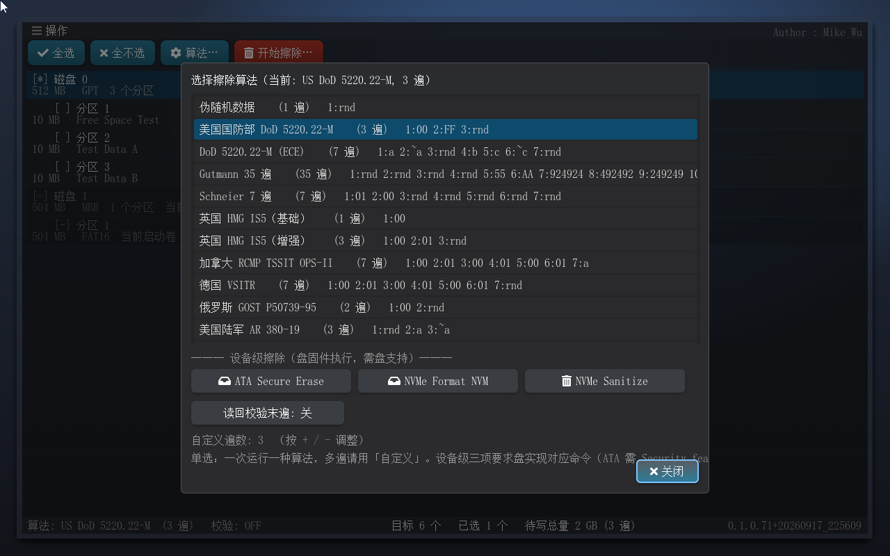 |

| 摘要核对（第 3 道闸门） | 输入 ERASE（第 4 道） |
|---|---|
| 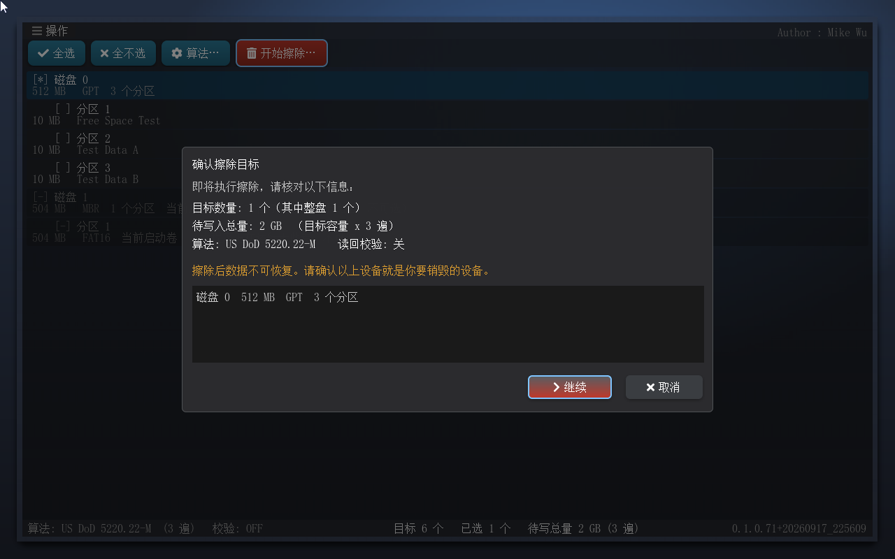 | 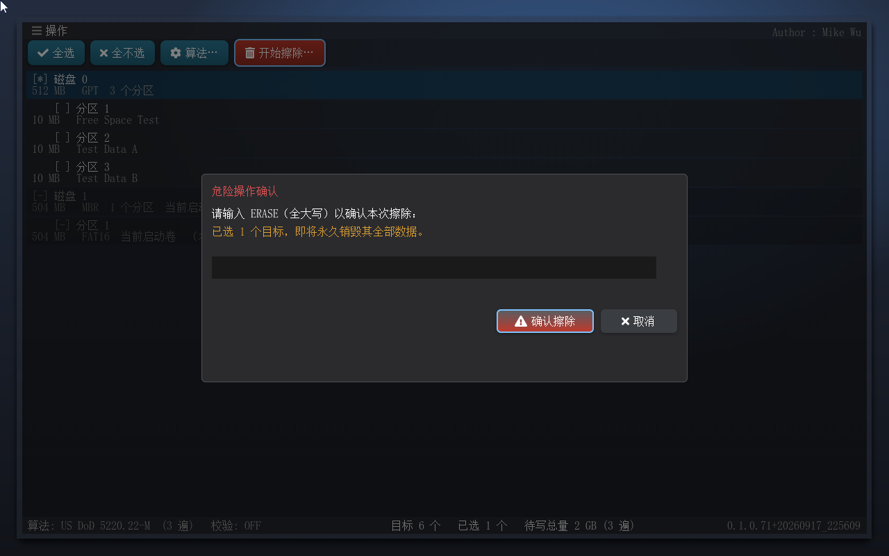 |

| 整盘容量确认（第 5 道） | 擦除进度（可持续取消） |
|---|---|
| 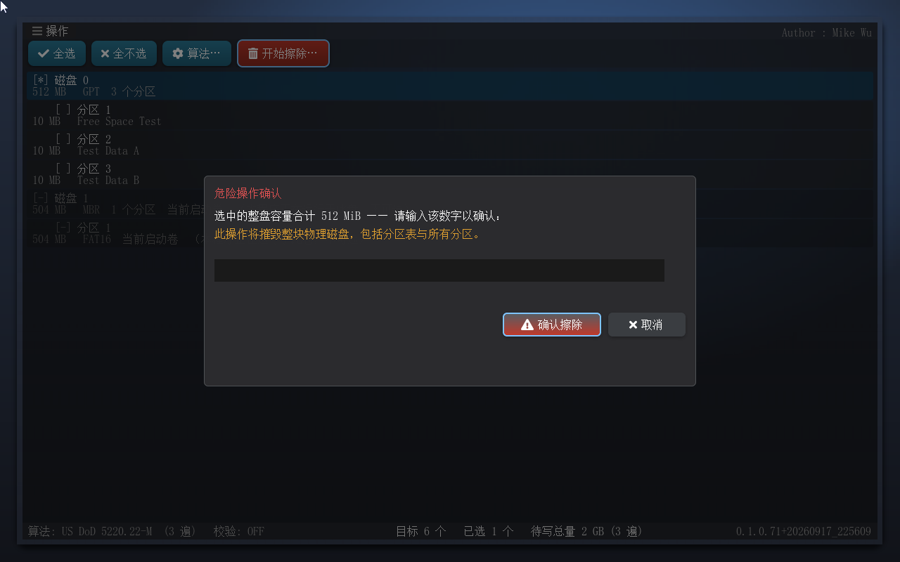 | 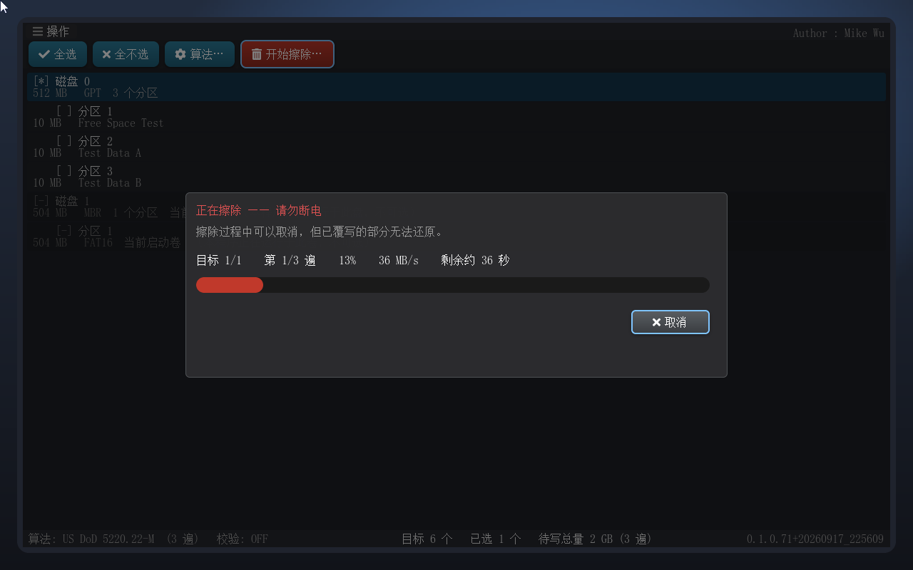 |

| 结果报告 | 擦除后目标列表自动变干净 |
|---|---|
| 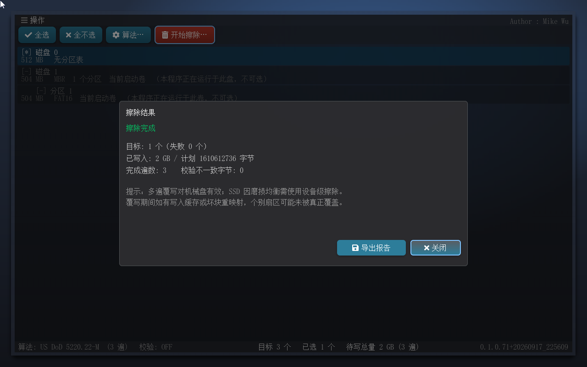 | 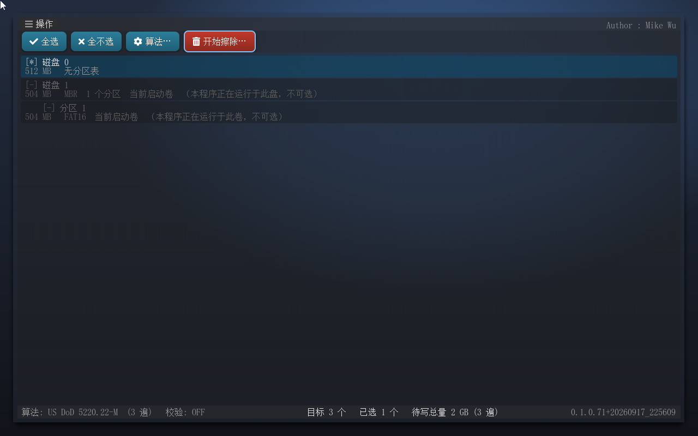 |

| 操作菜单（末项红色退出） | 导出报告结果弹窗 |
|---|---|
|  |  |

| 不可选目标的提示条 | Tab 焦点（蓝色描边，键盘可达） |
|---|---|
| 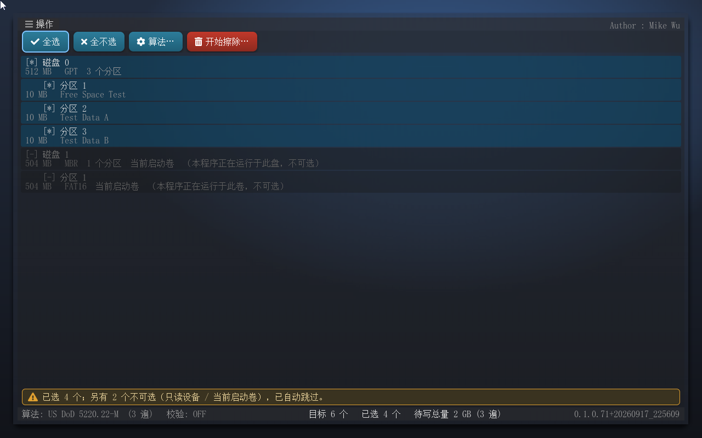 | 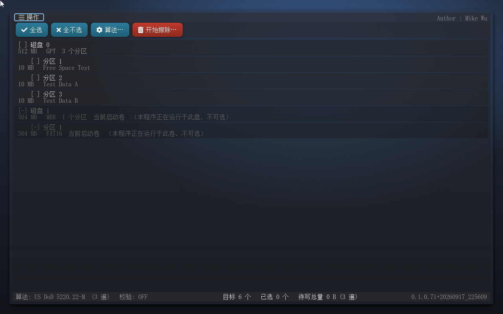 |

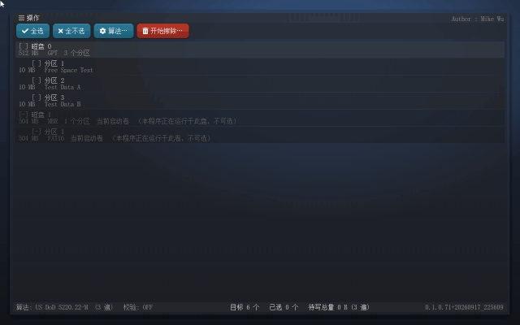

## 为什么算法是单选

擦除算法在这里就是**一次运行的遍次序列**：同一段盘字节上"既是 Gutmann 又是 DoD"没有意义——
后一遍会把前一遍的结果覆盖掉，最后一笔才是留下的。所以一次运行只允许一种算法，
需要更多遍就用「自定义（随机 N 遍）」。

这与同类工具一致：Eraser（每个任务一个 method）、DBAN（每次运行一个 method）、
Blancco / `shred` / `sdelete` 同样都是单方法；它们把"多"放在**方法内部的遍数**里。

## 算法说明

遍次模式**逐字节对照 Eraser 源码**确认。Eraser 只有两种遍次原语：`WriteConstant`
（按 1~3 字节模式周期填充）与 `WriteRandom`（PRNG 流），本项目增加第三种
`PASS_CONST_RANDOM`（每次擦除抽一个随机字节后重复），用于 RCMP 末遍、AR 380-19 的第 2/3 遍、
USAF 5020 的三遍。

有几处**与常见文献不同**，本项目按 Eraser 的字节值实现：Schneier 用 `0x01,0x00` 起手
（不是 `0xFF,0x00`）；VSITR 与 RCMP 交替用 `0x01` 而非 `0xFF`；HMG IS5 增强版第二遍是 `0x01`。

**一处有意偏离**：Eraser 对 Gutmann 设置了 `RandomizePasses = true`，执行前会打乱 35 遍顺序；
但 Gutmann 的 27 个模式是按序针对特定编码设计的，打乱会破坏算法本意。本项目**按 Gutmann
原文的规范顺序执行**。

## ⚠️ 关于 SSD

**多遍覆写对固态硬盘不可靠**。SSD 的 FTL 与磨损均衡会把写入重映射到不同的物理块，覆写逻辑
地址无法保证覆盖原数据。**固态盘请使用设备级擦除（ATA Secure Erase / NVMe Sanitize）**——
在算法选择器的下半部分可切换。

## 快速开始

1. 把 `UefiEraser.efi` 放到 FAT 格式的 U 盘或启动盘（如 ESP 分区）。
2. 开机进入 UEFI Shell，切换到对应卷：

```
Shell> fs0:
FS0:\> UefiEraser.efi
```

3. 在列表中选中目标（Ctrl+点击多选），点「开始擦除…」，按确认闸门走完流程。
4. 擦除记录自动保存在同目录的 `UefiEraser.log` 中。

### 无界面模式（自动化用）

```
FS0:\> UefiEraser.efi erase=disk:0 algo=gutmann verify
FS0:\> UefiEraser.efi erase=part:0:2 algo=dod522022m
FS0:\> UefiEraser.efi erase=freespace:0:1 algo=random
FS0:\> UefiEraser.efi erase=ata:0
FS0:\> UefiEraser.efi erase=nvme-format:0:1
FS0:\> UefiEraser.efi erase=nvme-sanitize:0:1
```

参数也可写在启动卷的 `UefiEraser.cfg`（UTF-16LE）里，供无法传命令行参数的引导方式使用。

| 参数 | 说明 |
|---|---|
| `erase=disk:<i>` | 第 i 块整盘（0 起，按枚举顺序） |
| `erase=part:<i>:<n>` | 第 i 块整盘的第 n 个分区 |
| `erase=freespace:<i>:<n>` | 第 i 块整盘的第 n 个分区的空闲空间 |
| `erase=ata:<i>` | 对第 i 块盘执行 ATA Secure Erase |
| `erase=nvme-format:<i>:<ses>` | 对第 i 块 NVMe 盘执行 Format NVM |
| `erase=nvme-sanitize:<i>:<act>` | 对第 i 块 NVMe 盘执行 Sanitize |
| `algo=<id>` | 算法 id（默认 `dod522022m`） |
| `custom=<n>` | 自定义算法的遍数 |
| `verify` | 开启末遍回读校验 |

## 擦除日志

每次擦除完成后，一条记录会追加到启动卷的 `UefiEraser.log`（UTF-8 CSV）。文件不存在时
自动创建；写入失败会被静默忽略，绝不阻断擦除本身。

```
iso_timestamp,target_name,mode,algo,passes,result,bytes_written
2026-09-16T16:43:47,disk:0,overwrite,random,1,OK,67108864
2026-09-16T16:45:44,freespace:1:1,freespace,random,1,OK,9437184
```

| 字段 | 说明 |
|---|---|
| `iso_timestamp` | 擦除结束时刻（ISO 8601，来自 RTC；固件时钟未校准时可能不准） |
| `target_name` | 目标标识，`disk:<i>` / `part:<i>:<n>` / `freespace:<i>:<n>` |
| `mode` | `overwrite` / `freespace` / `ata` / `nvme-format` / `nvme-sanitize` |
| `algo` | 算法 id；设备级擦除为 `-` |
| `passes` | 完成遍数；设备级为 `0`（由固件执行，主机无遍数概念） |
| `result` | `OK` / `CANCELLED` / `IO_ERROR` / `VERIFY_FAIL` / `PARAM_ERROR` / `MEDIA_CHANGED` |
| `bytes_written` | 主机侧写入字节数；设备级为 `0` |

UI 路径下每个目标擦完即记录一行，因此即使中途取消，已完成的部分也有据可查。

> **注意**：日志写在启动卷上。若擦除目标正是启动盘本身，日志会随数据一起被销毁——
> 这是预期行为（启动卷及其所在整盘被排除在可选目标之外，无法选中）。

## 构建

本仓只发布 `EraserPkg/` 源码包。构建需要：

1. EDK II 工作区（含 `MdePkg`、`PcAtChipsetPkg` 等）。
2. LVGL 的 UEFI 移植包 [LvglPkg](https://github.com/MikeWuPing/UEFI_LVGL)。
3. 把三者都放进 `PACKAGES_PATH`：

```
D:\edk2                 <- EDK II
D:\UEFI_LVGL            <- LvglPkg（即 PACKAGES_PATH 里的 LvglPkg\LvglPkg.dec）
D:\UefiEraser           <- 本仓（EraserPkg\EraserPkg.dec）
```

```bash
# 以 VS2019 工具链、X64 架构、DEBUG 目标为例
build -p EraserPkg/EraserPkg.dsc -a X64 -t VS2019 -b DEBUG
```

产物：`Build/EraserPkg/DEBUG_VS2019/X64/UefiEraser.efi`

要点：

- **仅支持 X64**（`SUPPORTED_ARCHITECTURES = X64`）。
- MSVC 必须带 `/utf-8`（已在 `UefiEraser.inf` 的 `[BuildOptions]` 里配好）：
  Core 与 Ui 的源码都是 UTF-8 中文字符串，不带这个开关会被按 cp936 解码而报错。
- `EraserPkg/Application/UefiEraser/Version.h` 由构建脚本按版本号生成，本仓随包提供一份
  与当前版本匹配的快照；换版本时改里面的 `UEFIERASER_VERSION_STR` 即可。
- 构建/取证/回归脚本（QEMU 驱动、主机侧断言、测试盘生成）在开发树中，暂未随本仓发布。

## 已实测通过

| 场景 | 结果 |
|---|---|
| 分区擦除（DoD 5220.22-M，3 遍，开校验） | `passes=3/3 written=31457280 verified=1 mismatches=0`；边界断言通过，非目标的分区 1、分区 3 各 10 MB 逐字节未动 |
| 整盘擦除（HMG IS5 Baseline，1 遍，开校验） | `passes=1/1 written=67108864 verified=1 mismatches=0`；全 0x00，LBA 1 上 `EFI PART` 签名消失 |
| 空闲空间擦除（伪随机 1 遍） | 残留标记清零，活跃文件（含 SHA256）完好，无临时文件遗留，FAT 元数据完好 |
| 设备级擦除（QEMU 虚拟盘） | 路径正确到达固件擦除层；虚拟盘不实现 Security feature set，返回原因明确的失败 |

Core 算法层带 360 项宿主机断言（算法表、遍次填充、Gutmann 35 遍逐字节、块边界相位、
取消、校验）。

## 目录

```
EraserPkg/
├── EraserPkg.dec / EraserPkg.dsc
├── Include/Library/
├── Library/FixedDebugPrintErrorLevelLib/
└── Application/UefiEraser/
    ├── Core/        擦除算法表、擦除引擎、目标模型、PRNG
    ├── Platform/    块设备枚举、分区映射、覆写、空闲空间、ATA/NVMe 设备级、日志持久化
    ├── Ui/          LVGL 界面（主窗口、对话框、进度、报告）
    └── UefiMain.c   入口：参数解析、无界面模式、UI 主循环
```

## 许可

MIT License, Copyright (c) 2026 Mike Wu。

界面基于 [LVGL](https://lvgl.io)（MIT）构建，UEFI 移植层见
[LvglPkg](https://github.com/MikeWuPing/UEFI_LVGL)。算法逐字节对照参考的 Eraser 项目为
GPLv3，仅作对照参考、不参与编译、不含在本仓内。

---

<a id="english"></a>

# UefiEraser — Disk Data Shredder for UEFI

> A graphical data-destruction tool that runs before any operating system boots:
> wipe **a whole physical disk**, **a single partition**, or **a volume's free space**
> with 13 industry-standard multi-pass overwrite algorithms, or hand the job to the
> drive firmware via ATA Secure Erase / NVMe Format / NVMe Sanitize.


> ⚠️ **Erasure is irreversible.** This tool destroys data — check the target and
> your backups before you start.

## Download

| File | What it is |
|---|---|
| [UefiEraser-0.1.0.71-X64.efi](https://github.com/MikeWuPing/UefiEraser/releases/download/v0.1.0.71/UefiEraser-0.1.0.71-X64.efi) | the ready-to-run UEFI application (X64, debug build, Chinese UI and font baked in) |
| [UefiEraser-产品手册-0.1.0.71.docx](https://github.com/MikeWuPing/UefiEraser/releases/download/v0.1.0.71/UefiEraser-Manual-zh-0.1.0.71.docx) | the product manual (Word, with every screen illustrated) |

See [Releases](https://github.com/MikeWuPing/UefiEraser/releases) for the latest version.
Copy `UefiEraser.efi` to a FAT-formatted USB stick, boot from it into the UEFI Shell and
run it (Secure Boot must be off).

## The problem it solves

- **Formatting is not destruction.** A quick format rewrites metadata and leaves the
  data on the platters; any recovery tool reads it back.
- **You cannot wipe the disk the OS is running from.** It is mounted and locked, so
  the job has to happen from outside the operating system.
- **Multi-pass overwriting is unreliable on SSDs.** The FTL and wear levelling remap
  writes to other physical blocks, so overwriting a logical address does not cover the
  original data — only the drive's own firmware can erase an SSD properly.
- **Destruction needs evidence.** A disk that leaves the building or goes to the
  shredder needs a record: which disk, which algorithm, how many passes, what result.

UefiEraser runs at exactly that point: at power-on, before the OS, when the firmware
hands over every disk as a plain block device.

## Features

- **Whole-disk shred** — overwrites every LBA of the physical disk, the partition
  table included.
- **Partition shred** — overwrites one partition with **exact boundaries**;
  neighbouring partitions are untouched (proven byte by byte by the host assertions).
- **Free-space shred** — overwrites the unused clusters of a volume without deleting
  existing files, destroying remnants of already-deleted files.
- **Device-level erase** — ATA Secure Erase / NVMe Format NVM / NVMe Sanitize, run by
  the drive firmware over every physical region including over-provisioning and
  retired blocks (**the only reliable method for SSDs**).
- **13 industry-standard overwrite algorithms**, reproduced byte for byte against the
  Eraser project: pseudorandom (1 pass), US DoD 5220.22-M (3), DoD 5220.22-M ECE (7),
  Gutmann (35), Schneier (7), British HMG IS5 Baseline/Enhanced, Canadian RCMP TSSIT
  OPS-II, German VSITR, Russian GOST P50739-95, US Army AR 380-19, US Air Force 5020,
  plus a custom N-pass random method.
- **Optional read-back verification** of the last pass — every byte read back and
  compared against a replay of that pass's generator.
- **Five safety gates** — read-only devices cannot be selected → the boot volume (and
  the disk it sits on) cannot be selected → a summary dialog states the count, capacity,
  algorithm and pass count → typing `ERASE` is required → selecting a whole disk adds a
  fifth gate asking for that disk's capacity.
- **Report export** — the result dialog writes `UefiEraser-report.txt` (UTF-8) to the
  boot volume (button or **F2**); unattended runs write it automatically.
- **CSV audit log** — every run appends one record to `UefiEraser.log` on the boot
  volume: timestamp, target, mode, algorithm, passes, result, bytes written.
- **Rescan after erasing, judged from the media** — every disk's partition table is
  read again from LBA 0 and rows the media no longer describes are dropped, so a disk
  whose partitions were destroyed stops listing any (its second line becomes 无分区表).
  操作 → 重新扫描目标 does the same on demand. The firmware's handle database is left
  alone; the list is derived from the bytes on the disk.
- **A failure says why** — the device-level modes are executed by the disk's own
  firmware; when it cannot, the report names the cause (no ATA Pass-Thru covers it,
  no Security feature set, FROZEN, …) rather than settling for "I/O error".
- **Fully reachable by mouse and keyboard** — Ctrl/Shift+click, arrow keys and Space
  for multi-selection; Tab walks every button in the window in order and cycles the
  buttons inside a dialog, each focus carrying a blue ring, with Enter activating,
  Del clearing the selection and F2 exporting the report. The 操作 / Actions menu
  holds seven entries including a rescan, and ends with a red 退出 / Quit.
- **Actions answer back** — buttons carry icons and hover/pressed/focused states;
  clicking a target that cannot be selected raises a hint bar saying why, 全选 reports
  how many rows it skipped, and a wrong gate entry raises a popup saying what to type.
- **Interface** — Win11-style frosted glass (wallpaper + downsampled blur + tint +
  shadow) with dialog transitions; the glass layer switches itself off during an
  erasure so the progress bar does not dirty the whole screen on every sample.
- **Ctrl+Alt+Del resets the whole machine** — the firmware handles that combination
  through the console's key-notification channel, so an application cannot swallow it;
  it will interrupt an erasure mid-pass. Use the progress dialog's 取消 / Cancel instead.

## Interface

| Target selection (multi-select) | Algorithm picker (overwrite above, device-level below) |
|---|---|
|  |  |

| Summary (gate 3) | Type ERASE (gate 4) |
|---|---|
|  |  |

| Capacity (gate 5) | Progress (cancellable throughout) |
|---|---|
|  |  |

| Result report | The list cleans itself up after an erasure |
|---|---|
|  |  |

| Actions menu (red Quit at the end) | Export result popup |
|---|---|
|  |  |

| Hint bar for an unselectable target | Tab focus (blue ring, keyboard reachable) |
|---|---|
|  |  |


## Why one algorithm per run

An algorithm here **is** the pass sequence of a run: bytes cannot be "both Gutmann and
DoD" — the later pass overwrites the earlier one and only the last write survives. So a
run takes exactly one method, and you use the custom N-pass method when you want more.

This matches the rest of the field: Eraser (one method per task), DBAN (one method per
run), Blancco, `shred` and `sdelete` are all single-method, and put the "more" into the
passes inside the method.

## Algorithms

The pass patterns were checked **byte for byte against Eraser's sources**. Eraser has
exactly two pass primitives — `WriteConstant` (a 1–3 byte pattern repeating across the
buffer) and `WriteRandom` (a PRNG stream). This project adds a third,
`PASS_CONST_RANDOM` (draw one random byte per erasure, then repeat it), used by RCMP's
last pass, AR 380-19's 2nd/3rd passes and all three USAF 5020 passes.

Several values **differ from the popular write-ups**; this project implements Eraser's
bytes: Schneier starts `0x01, 0x00` (not `0xFF, 0x00`); VSITR and RCMP alternate `0x01`
rather than `0xFF`; HMG IS5 Enhanced's second pass is `0x01`.

**One deliberate deviation:** Eraser sets `RandomizePasses = true` for Gutmann and
shuffles the 35 passes before running them. Gutmann's 27 patterns are ordered on
purpose — each targets a specific encoding — so this project runs them in Gutmann's
published order.

## ⚠️ About SSDs

**Multi-pass overwriting is not reliable on solid-state drives.** The FTL and wear
levelling remap writes to different physical blocks, so overwriting a logical address
does not guarantee the original data was covered. **Use device-level erase (ATA Secure
Erase / NVMe Sanitize) on SSDs** — switch to it in the lower half of the algorithm
picker.

## Quick start

1. Copy `UefiEraser.efi` to a FAT-formatted USB stick or boot volume (the ESP, for
   example).
2. Boot into the UEFI Shell and switch to that volume:

   ```
   Shell> fs0:
   FS0:\> UefiEraser.efi
   ```

3. Select the targets (Ctrl+click for multiple), click 开始擦除…, and walk through the
   confirmation gates.
4. The run is recorded in `UefiEraser.log` next to the application.

### Unattended mode

```
FS0:\> UefiEraser.efi erase=disk:0 algo=gutmann verify
FS0:\> UefiEraser.efi erase=part:0:2 algo=dod522022m
FS0:\> UefiEraser.efi erase=freespace:0:1 algo=random
FS0:\> UefiEraser.efi erase=ata:0
FS0:\> UefiEraser.efi erase=nvme-format:0:1
FS0:\> UefiEraser.efi erase=nvme-sanitize:0:1
```

The same arguments can be placed in `UefiEraser.cfg` (UTF-16LE) on the boot volume, for
boot paths that cannot pass a command line.

| Argument | Meaning |
|---|---|
| `erase=disk:<i>` | whole disk `i` (0-based, enumeration order) |
| `erase=part:<i>:<n>` | partition `n` of disk `i` |
| `erase=freespace:<i>:<n>` | free space of partition `n` of disk `i` |
| `erase=ata:<i>` | ATA Secure Erase on disk `i` |
| `erase=nvme-format:<i>:<ses>` | NVMe Format NVM on disk `i` |
| `erase=nvme-sanitize:<i>:<act>` | NVMe Sanitize on disk `i` |
| `algo=<id>` | algorithm id (default `dod522022m`) |
| `custom=<n>` | pass count for the custom method |
| `verify` | enable read-back verification of the last pass |

## Audit log

Every completed erasure appends one record to `UefiEraser.log` on the boot volume
(UTF-8 CSV). The file is created if missing; a write failure is silently ignored and
never blocks the erasure itself.

```
iso_timestamp,target_name,mode,algo,passes,result,bytes_written
2026-09-16T16:43:47,disk:0,overwrite,random,1,OK,67108864
2026-09-16T16:45:44,freespace:1:1,freespace,random,1,OK,9437184
```

| Field | Meaning |
|---|---|
| `iso_timestamp` | when the erasure finished (ISO 8601, from the RTC; may be wrong if the firmware clock is unset) |
| `target_name` | `disk:<i>` / `part:<i>:<n>` / `freespace:<i>:<n>` |
| `mode` | `overwrite` / `freespace` / `ata` / `nvme-format` / `nvme-sanitize` |
| `algo` | algorithm id, or `-` for device-level erasure |
| `passes` | passes completed; `0` for device-level (the firmware owns the pass count) |
| `result` | `OK` / `CANCELLED` / `IO_ERROR` / `VERIFY_FAIL` / `PARAM_ERROR` / `MEDIA_CHANGED` |
| `bytes_written` | host-side bytes written; `0` for device-level |

In UI mode a record is written as soon as each target finishes, so a cancelled run
still leaves an auditable trail of what was completed.

> **Note:** the log lives on the boot volume. If the boot volume is what you erase, it
> dies with it — which is expected (the boot volume and its whole disk are excluded
> from the selectable targets and cannot be armed at all).

## Build

This repository ships the `EraserPkg/` source package only. To build it you need:

1. An EDK II workspace (with `MdePkg`, `PcAtChipsetPkg`, …).
2. The LVGL UEFI port, [LvglPkg](https://github.com/MikeWuPing/UEFI_LVGL).
3. All three on `PACKAGES_PATH`:

```
D:\edk2                 <- EDK II
D:\UEFI_LVGL            <- LvglPkg (i.e. LvglPkg\LvglPkg.dec on PACKAGES_PATH)
D:\UefiEraser           <- this repository (EraserPkg\EraserPkg.dec)
```

```bash
build -p EraserPkg/EraserPkg.dsc -a X64 -t VS2019 -b DEBUG
```

Output: `Build/EraserPkg/DEBUG_VS2019/X64/UefiEraser.efi`

Things worth knowing:

- **X64 only** (`SUPPORTED_ARCHITECTURES = X64`).
- MSVC needs `/utf-8` (already set in `UefiEraser.inf`'s `[BuildOptions]`): the Core and
  Ui sources carry UTF-8 Chinese strings, which MSVC otherwise decodes as cp936 and
  fails on.
- `EraserPkg/Application/UefiEraser/Version.h` is generated from the version number; a
  snapshot matching the current version ships with this repository — edit
  `UEFIERASER_VERSION_STR` when you bump it.
- The build / forensics / regression scripts (QEMU driver, host assertions, test-disk
  generator) live in the development tree and are not published here.

## Measured results

| Scenario | Result |
|---|---|
| Partition erase (DoD 5220.22-M, 3 passes, verification on) | `passes=3/3 written=31457280 verified=1 mismatches=0`; boundary assertions pass and the non-target partitions (10 MB each) are unchanged byte for byte |
| Whole-disk erase (HMG IS5 Baseline, 1 pass, verification on) | `passes=1/1 written=67108864 verified=1 mismatches=0`; all `0x00`, the `EFI PART` signature is gone from LBA 1 |
| Free-space erase (pseudorandom, 1 pass) | residue markers cleared, live files intact (SHA256 checked), no temp files left behind, FAT metadata intact |
| Device-level erase (QEMU virtual disk) | the path reaches the firmware erase layer; the virtual disk implements no Security feature set, so it fails with a stated reason |

The Core algorithm layer carries 360 host-side assertions (algorithm table, pass filling,
Gutmann's 35 passes byte by byte, chunk-boundary phase, cancellation, verification).

## Layout

```
EraserPkg/
├── EraserPkg.dec / EraserPkg.dsc
├── Include/Library/
├── Library/FixedDebugPrintErrorLevelLib/
└── Application/UefiEraser/
    ├── Core/        erasure algorithm table, engine, target model, PRNG
    ├── Platform/    block-device enumeration, partition mapping, overwrite,
    │                free space, ATA/NVMe device-level, log persistence
    ├── Ui/          LVGL interface (main window, dialogs, progress, report)
    └── UefiMain.c   entry: argument parsing, unattended mode, UI main loop
```

## License

MIT License, Copyright (c) 2026 Mike Wu.

The interface is built on [LVGL](https://lvgl.io) (MIT); the UEFI port is
[LvglPkg](https://github.com/MikeWuPing/UEFI_LVGL). The Eraser project, whose bytes the
algorithms were checked against, is GPLv3 — it is reference material only, is not
compiled, and is not included in this repository.
